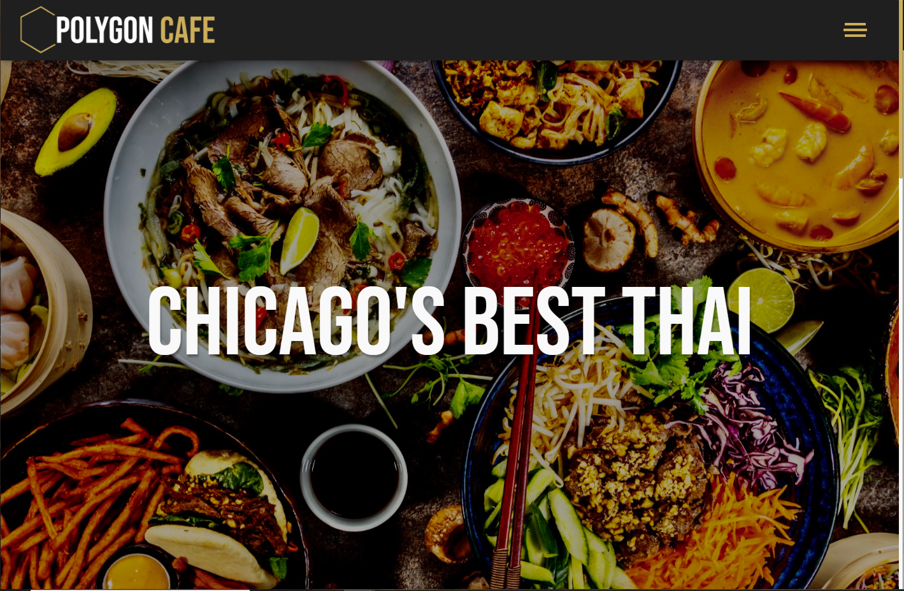
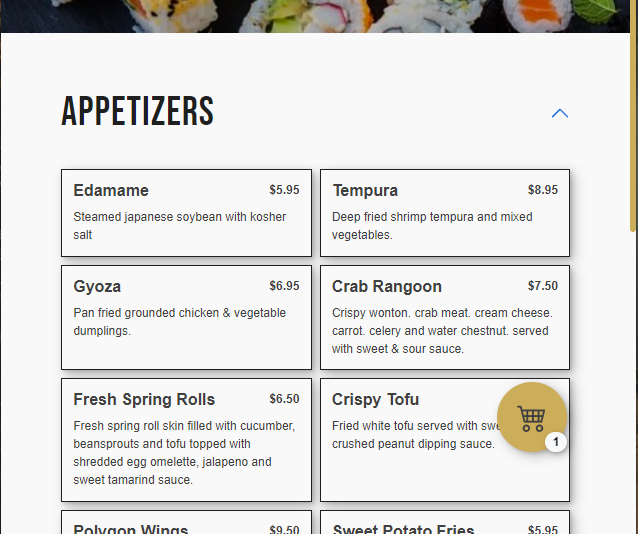
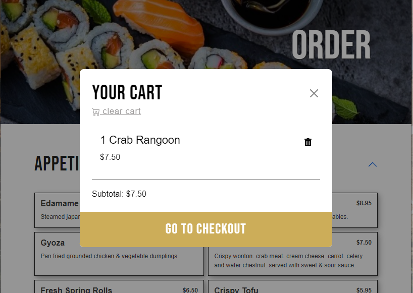
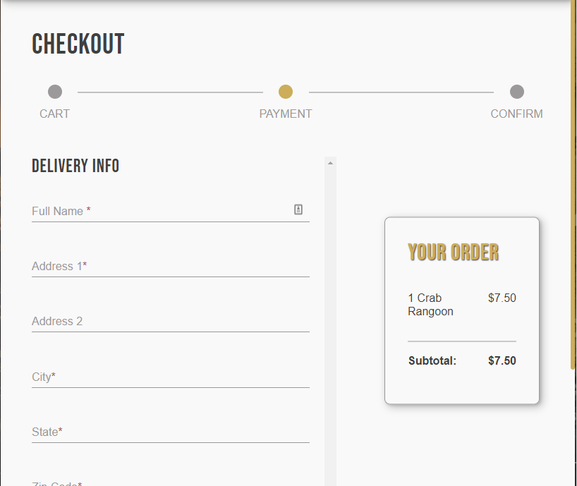

# Polygon Cafe: A Shopping Cart App and Restaurant Site

This is a website I made on spec for Polygon Cafe, a Chicago Northside Thai and Sushi restaurant. It features the Google Maps API as well as a shopping cart app and mock checkout functionality with React Forms.

I started this project because I wanted learn more advanced skills in React while simultaneously striving to improve my sense of design. 

## Screenshots

## Tech Stack

- React for creating reusable components, React Router for dynamic routing, and React Context for state management.
- Sass, SCSS, and Bootstrap for styling
- Deployed via Netlify

## Features

- Shopping cart functionality
- React Forms
- Responsive for various screen sizes
- Google Maps API

